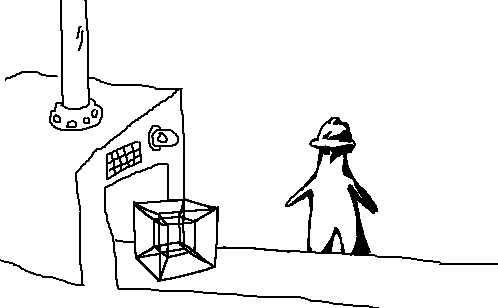

# The Geometry Factory



A C geometry processing library with a clean Julia REPL interface. Fast core operations in C, safe bindings in Julia, minimal dependencies. Write and test geometry code interactively without leaving the REPL.

## How it Works

The Geometry Factory processes geometry in C and exposes it through Julia:

1. Write geometry operations in C for speed
2. Access them through Julia's REPL
3. See results immediately in OpenGL
4. Modify parameters in real-time
5. Export when you're done

No configuration files, no build steps, no context switching. Just you and your geometry.

## Dependencies

### C Library
- C compiler with C17 support (GCC/Clang)
- CMake 3.10 or higher
- OpenGL development libraries
- GLFW3

### Julia Interface
- Julia 1.6 or higher
- Libdl (standard library)

GLAD is included in the source tree. If you need to regenerate it, use the [GLAD web service](https://glad.dav1d.de/) with:
- Language: C/C++
- Specification: OpenGL
- API: gl Version 3.3
- Profile: Core

## Building

### On Ubuntu/Debian:
```bash
# Install dependencies
sudo apt install build-essential cmake libglfw3-dev libgl1-mesa-dev

# Build C library
mkdir build && cd build
cmake ..
make
```

### On Other Systems
Ensure you have a C compiler, CMake, and GLFW3 installed. Build process is the same.

## Usage

### Basic Example
```julia
# Load the module
include("src/GeometryFactory.jl")
using .GeometryFactory

# Initialize window
initialize(800, 600)

# Create and show a triangle fan
vertices = create_triangle_fan((0.0f0, 0.0f0), 0.5f0, 8)
update_vertices!(vertices)

# Modify in real-time
vertices = create_triangle_fan((0.0f0, 0.0f0), 0.7f0, 16)  # Bigger circle
update_vertices!(vertices)

# Clean up
cleanup()
```

## Documentation

For detailed API reference and implementation details, see the [API Documentation](docs/API.md).

## License

See the `LICENSE` file for details.
